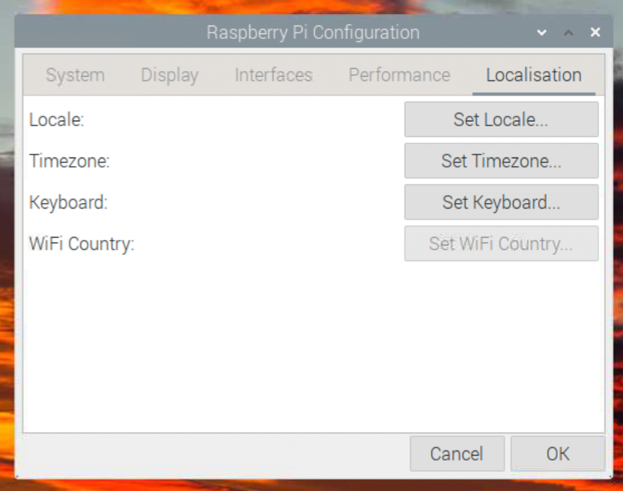
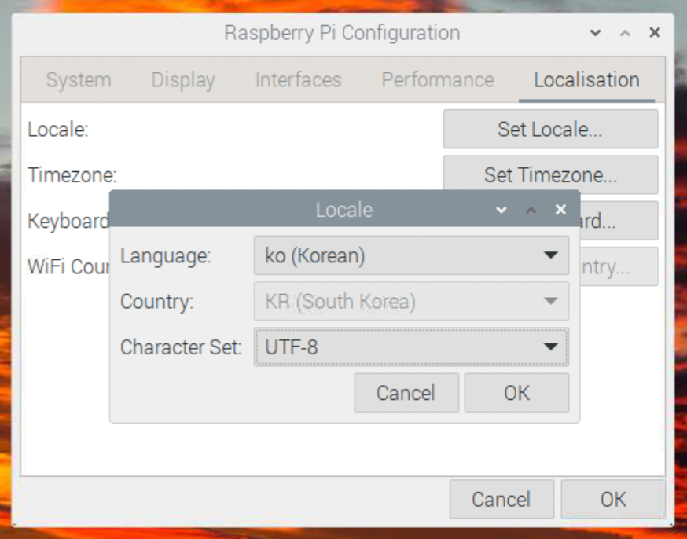
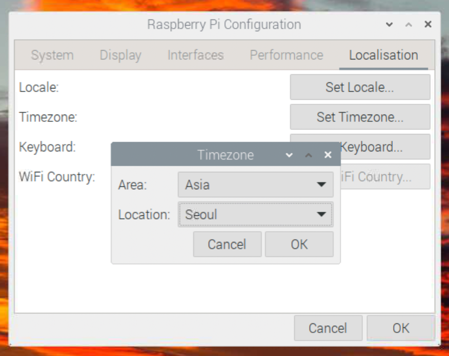

# 라즈베리파이 한국어 설치

### 터미널에서 아래 명령어 실행

```
sudo apt install fonts-unfonts-core
```


### 좌측 상단 -> Preferences -> Raspberry Pi Configuration -> Localisation




### Locale 설정




### Timezone 설정




### 한글 패키지 설치

```
sudo apt remove ibus ibus-hangul
sudo apt install fcitx fcitx-hangul
```


### 재부팅

```
sudo reboot
```
